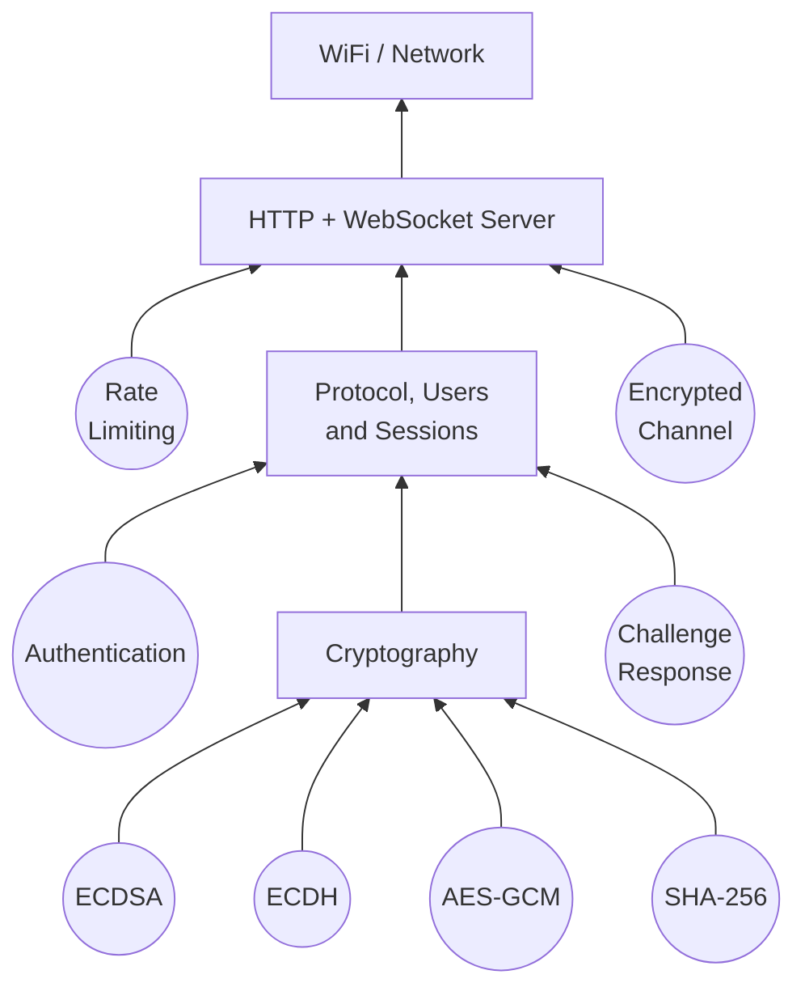

# esp-iot-comm

`esp-iot-comm` is an enterprise-grade ESP-IDF component that handles secure device-to-server communication, wireless provisioning, and network services. It integrates cryptographic operations (AES, P-256 ECC), protocol handling, and a lightweight HTTP/WebSocket server.

## Key Features

- **Secure Communication**: AES encryption, ECDSA signatures, and challenge-response authentication.
- **WiFi Provisioning**: Automatic device provisioning with BLE/SoftAP support.
- **Protocol Stack**: Custom binary protocol with packet parsing and command handling.
- **HTTP/WebSocket Server**: Lightweight server for device control and real-time communication.
- **Network Services**: mDNS support for device discovery.
- **Session Management**: User authentication and session tracking.
- **Cryptography**: ECC (P-256), hashing (SHA-256), AES encryption via MbedTLS.

## Components

| Component       | Description                                                           |
|-----------------|-----------------------------------------------------------------------|
| `server`        | HTTP/WebSocket server with session management and user authentication |
| `provisioning`  | WiFi provisioning and network setup                                   |
| `mDNS`          | mDNS service advertising for device discovery                         |
| `crypto`        | Cryptographic primitives: AES, P-256 ECC, SHA-256 hashing             |
| `binary_reader` | Safe binary data parsing utilities                                    |
| `challenge`     | Challenge-response authentication mechanism                           |
| `rate_limit`    | Request rate limiting for security                                    |

## Architecture



## Installation

Open your project's `idf_component.yml` file and add the `dependencies` section if not present.
Then append the desired component like the following example:

```yaml
dependencies:
  mxmauro/esp_iot_comm:
    git: https://github.com/mxmauro/esp-iot-comm.git
    version: "*"   # You can also specify a tag, branch or commit hash
```

Save the changes and run the following command:

```bash
idf.py reconfigure   # or idf.py build
```

## Requirements

- ESP-IDF v5.5 or later
- Target: ESP32 (Linux simulator not supported)
