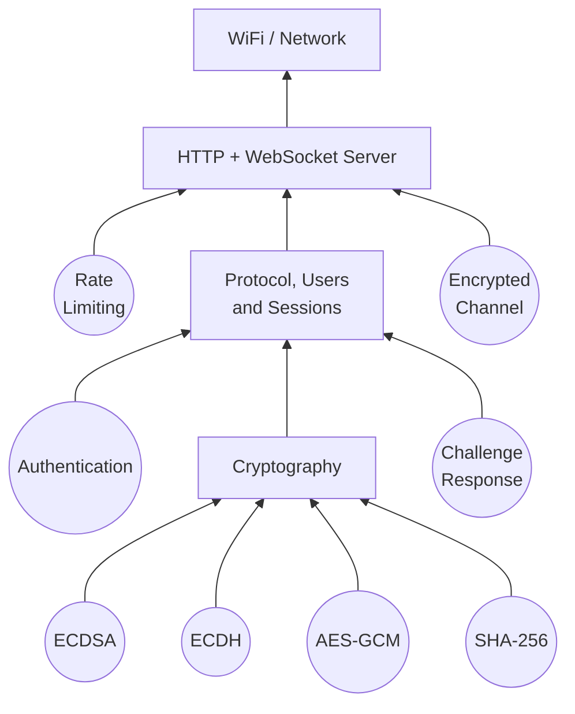

# esp-iot-comm

`esp-iot-comm` is an ESP-IDF component for secure device-to-server communication, Wi-Fi provisioning, and local network services. It brings
 together the cryptographic building blocks, protocol handling, and a lightweight HTTP/WebSocket server needed to ship those features as a
 single reusable component.

> [!WARNING]
> This project is under active development, so its structure, APIs, and definitions may change between releases without prior notice.

## Key Features

* **Secure Communication**: AES encryption, ECDSA signatures, and challenge-response authentication.
* **Wi-Fi Provisioning**: Provisioning workflow with SoftAP support and captive portal integration.
* **Captive Portal**: Built-in HTTP server, DNS interception, and credential handoff flow for device onboarding.
* **Protocol Stack**: Custom binary protocol with packet parsing and command handling.
* **HTTP/WebSocket Server**: Lightweight server for device control and real-time communication.
* **Network Services**: mDNS support for device discovery.
* **Session Management**: User authentication and session tracking.
* **Cryptography**: ECC (P-256), hashing (SHA-256), AES encryption via MbedTLS.

## Components

| Component       | Description                                                           |
|-----------------|-----------------------------------------------------------------------|
| `server`        | HTTP/WebSocket server with session management and user authentication |
| `provisioning`  | Wi-Fi provisioning, captive portal flow, and network setup            |
| `mDNS`          | mDNS service advertising for device discovery                         |
| `crypto`        | Cryptographic primitives: AES, P-256 ECC, SHA-256 hashing             |
| `binary_reader` | Safe binary data parsing utilities                                    |
| `challenge`     | Challenge-response authentication mechanism                           |
| `rate_limit`    | Request rate limiting for security                                    |

## Documentation

* [IoT communication server](docs/IOT_COMM.md)
* [Wi-Fi provisioning](docs/WIFI_PROVISIONING.md)
* [Captive portal](docs/CAPTIVE_PORTAL.md)
* [OTA update flow](docs/OTA.md)

## Architecture


```mermaid
flowchart BT
    B["HTTP + WebSocket Server"] --> A["WiFi / Network"]
        FEAT1_B(("Rate<br>Limiting")) --> B
    C["Protocol, Users<br>and Sessions"] --> B
    FEAT2_B(("Encrypted<br>Channel")) --> B
    FEAT1_C(("Authentication")) --> C
    D["Cryptography"] --> C
    FEAT2_C(("Challenge<br>Response")) --> C
    FEAT1_D(("ECDSA")) --> D
    FEAT2_D(("ECDH")) --> D
    FEAT3_D(("AES-GCM")) --> D
    FEAT4_D(("SHA-256")) --> D
```

## Installation

Open your project's `idf_component.yml` file and add a `dependencies` section if it does not already exist. Then add the component like in
 the following example:

```yaml
dependencies:
  mxmauro/esp_iot_comm:
    git: https://github.com/mxmauro/esp-iot-comm.git
    version: "*"   # You can also specify a tag, branch or commit hash
```

After that, run:

```bash
idf.py reconfigure   # or idf.py build
```

## Requirements

- ESP-IDF v5.5 or later
- Target: ESP32 (Linux simulator not supported)

## Examples

- `examples/provisioning/`: an end-to-end provisioning flow with the captive portal, hostname setup, and the transition into STA mode.
